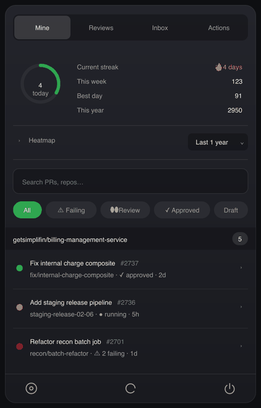

<p align="center"></p>

<h1 align="center">Git Menu</h1>

<p align="center">
  <a href="https://github.com/Artim-Nayas/git-menu/releases/latest"></a>
  <a href="https://github.com/Artim-Nayas/git-menu/actions/workflows/ci.yml"></a>
  <a href="LICENSE"></a>
  
</p>

<p align="center"><b><a href="https://artim-nayas.github.io/git-menu/">artim-nayas.github.io/git-menu</a></b></p>

<p align="center">
A lightweight macOS menu-bar app for your GitHub work — pull requests, review
requests, a notifications inbox, GitHub Actions runs, and your contribution
activity — without leaving the menu bar. Powered entirely by the
<a href="https://cli.github.com"><code>gh</code></a> CLI, so it uses your
existing GitHub auth.
</p>

> Status: early. macOS (Apple Silicon) only for now.

## Preview

<p align="center"></p>

> The status dot on each row shows CI state at a glance — 🟢 passing, 🟡 running,
> 🔴 failing — across your PRs and Actions runs.
>
> <sub>All four tabs, side by side: <a href="docs/tour.png">docs/tour.png</a>. (Renders built from the live UI via <code>npm run promo</code>.)</sub>

First, install and authenticate the GitHub CLI (Git Menu rides its auth):

```bash
brew install gh
gh auth login
```

### Option A — Homebrew (recommended)

```bash
brew install --cask artim-nayas/tap/git-menu
```

The cask clears the download quarantine for you, so Git Menu opens on first
launch with no Gatekeeper dance. Update later with
`brew upgrade --cask git-menu`.

### Option B — Download the DMG

1. Download the latest **`Git Menu-*.dmg`** from
   [Releases](https://github.com/Artim-Nayas/git-menu/releases).
2. Open the DMG and drag **Git Menu** to Applications.
3. **First launch:** the app is ad-hoc signed but not notarized (free, no Apple
   Developer account), so macOS gates the first open. **Surest way** — clear the
   download quarantine once, then open normally:
   ```bash
   xattr -dr com.apple.quarantine "/Applications/Git Menu.app"
   ```
   **Or, without Terminal:**
   - **macOS 15 (Sequoia) and newer:** double-click → on "Apple could not verify…"
     click **Done**, then go to **System Settings → Privacy & Security**, scroll to
     **Security**, and click **Open Anyway** next to Git Menu → authenticate → **Open Anyway**.
   - **Older macOS:** **right-click the app → Open → Open**.

   Do **not** click "Move to Bin" — the app is fine, just not Apple-notarized.

The app lives in your menu bar (no Dock icon). Click the icon to see your PRs.

## Features

- **Mine / Reviews / Inbox** tabs — your open PRs, PRs awaiting your review, and
  a smart notifications inbox (review requests, mentions, replies).
- **Actions** tab — recent GitHub Actions runs across your repos, with
  expandable per-run jobs and steps, plus per-PR check status.
- **Contribution activity** — streak, today, and an expandable heatmap.
- **At-a-glance status** — CI state, review decision, diffstat, labels.
- **Menu-bar count** of items that actually need you.
- **Keyboard-first** — global hotkey, `j`/`k` navigation, quick search.
- **Self-updating** — check for and install updates from Settings.

## Build from source

```bash
git clone https://github.com/Artim-Nayas/git-menu.git
cd git-menu
npm install
npm run dev      # run locally
npm run build    # produce an unsigned DMG + ZIP in ./release
```

## Contributing

Issues and PRs welcome. This is an open-source MIT project — see [LICENSE](LICENSE).

## Releasing (maintainers)

Releases are built and published automatically by GitHub Actions on any `v*` tag.

```bash
git checkout main && git pull   # release from a clean, up-to-date main
npm run release                 # bumps the patch version, tags, and pushes the tag
# or, for a minor/major bump:
npm version minor && git push --follow-tags
```

The `Release` workflow builds the unsigned `.dmg` + `.zip` on a macOS runner and
attaches them to a new GitHub Release for that tag. (The app is unsigned — see the
first-launch note under Install.)

After publishing, **set proper, human-written release notes** — the workflow's
auto-generated commit list is only a fallback:

```bash
gh release edit vX.Y.Z --notes-file notes.md --latest
```

**Homebrew cask** lives in [`Artim-Nayas/homebrew-tap`](https://github.com/Artim-Nayas/homebrew-tap).
The release workflow bumps it automatically (version + sha256) once a
`HOMEBREW_TAP_TOKEN` repo secret is set — a fine-grained PAT with **Contents:
read/write** on the `homebrew-tap` repo. Without the secret, that step is skipped
and the cask can be bumped by hand.

**Promo art** (`docs/demo.gif`, `docs/tour.png`, `docs/social-preview.png`) is
regenerated from the live UI with `npm run promo`.

## License

[MIT](LICENSE) © 2026 Artim-Nayas
